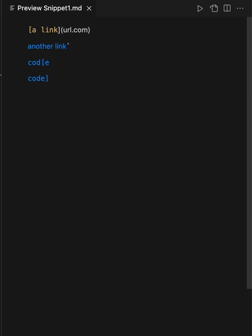
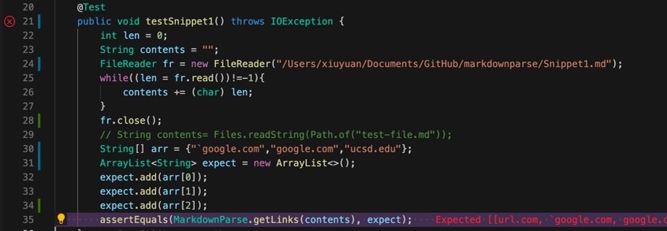
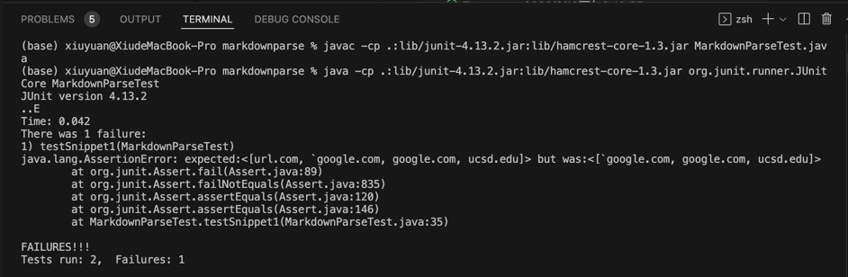
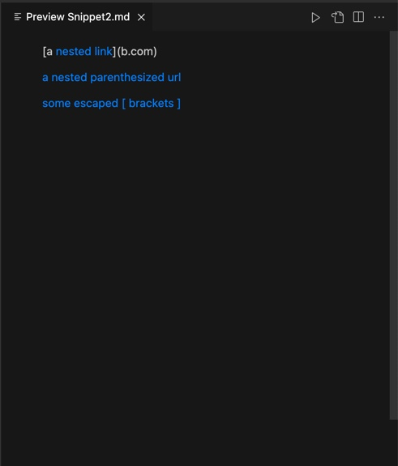
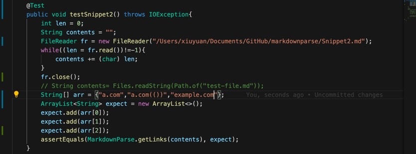
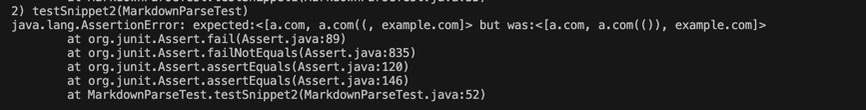
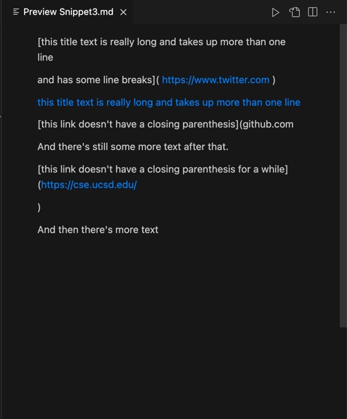
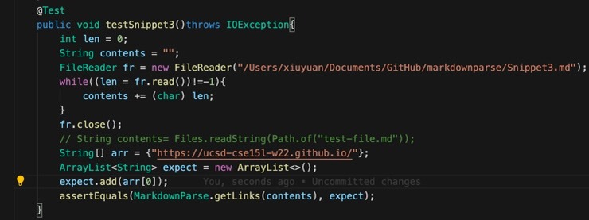
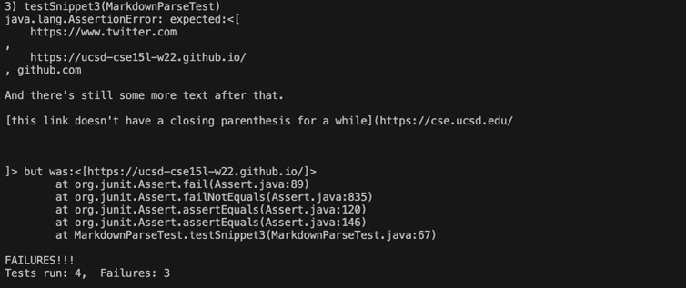

# Week 8: Lab Report 4

[Link of my own code][1]

[Link of the code I reviewed][2]

[1]: https://github.com/xiuyuan0216/markdown-parse.git

[2]: https://github.com/clingunis/markdown-parse.git
## Snippet 1

> The following is the markdown preview of Snippet 1:

> We see that url.com is not counted as a link by markdown. Therefore, the links should be 'google.com, google.com, and ucsd.edu. My test method is as follows.

> Then the following picture is the Junit output of my code.

>The following picture is the Junit output of my code. It is basically the same as the output of my code.

> I don't think a small change can make my program work for Snippet with inline backticks. Only the open bracket cannot be surrounded by a pair of backticks. It is okay for close paren to have a pair of backticks surrounded. Therefore, it is very difficult to use small changes to handle these different cases. A more involved change is needed.

## Snippet 2

>The following is the markdown preview of Snippet 2:

> As we can see, for nested links, the outer b.com is not counted by markdown as a valid link. Therefore, the links should be a.com, a.com(()), and example.com. My test method is as follows.

>Then the following picture is the Junit output of my program:

>The following picture is the Junit output of the program I reviewed:

>I don't think a small change to my code can solve this problem. For nested parentheses, except the outer pair of parentheses, others are regarded as part of the link. Here, a stack should be used to handle this kind of situation, and that would be totally different code from our current MarkdownParse.

## Snippet 3

>The following picture is the markdown preview of Snippet 3:

> As we can see, there should not be an empty line inside brackets or parentheses. Therefore, only https://ucsd-cse15l-w22.github.io/ is counted by markdown as a valid link. My test method is as follows:

>Then the following is the Junit output of my own program:

> The following is the Junit output of the program I review:

>I don't think a small change can solve this problem. We should add some codes to examine whether there is empty lines within brackets and parentheses. We should also check whether there is space before and in the link. These tasks cannot be well dealt with by using merely small changes.